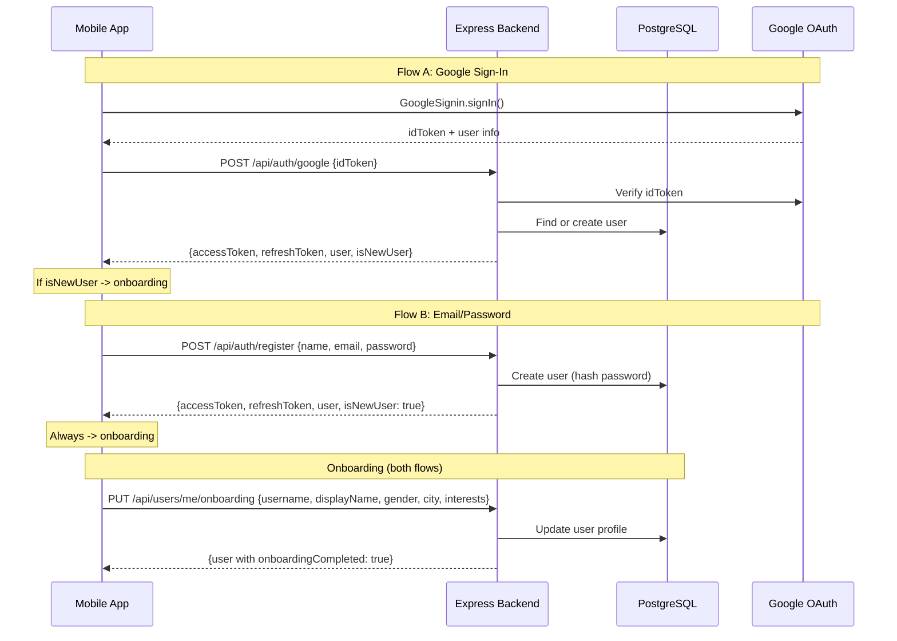

# wispaCart Auth + Onboarding Backend

## What We're Building

A backend that handles two auth flows (Google Sign-In + email/password) and persists onboarding data. After this, a user can sign up, complete onboarding, and have their profile stored in PostgreSQL instead of AsyncStorage.




---

## Part 1: Backend Project Setup

Create `backend/` folder at `c:\Users\tamas\WISPACART CODE2025PJ\backend\` (sibling to `wispaCart/`).

### Project structure:

```
backend/
  src/
    config/
      env.ts            # Environment variables with Zod validation
      database.ts       # Prisma client singleton
    middleware/
      auth.ts           # JWT verification middleware
      errorHandler.ts   # Global error handler
      validate.ts       # Zod request validation middleware
    routes/
      auth.routes.ts    # POST /auth/google, /auth/register, /auth/login, /auth/refresh
      user.routes.ts    # GET/PUT /users/me, PUT /users/me/onboarding
    controllers/
      auth.controller.ts
      user.controller.ts
    services/
      auth.service.ts   # Google token verification, JWT generation, password hashing
      user.service.ts   # User CRUD, onboarding logic
    types/
      index.ts          # Shared types (will mirror frontend types)
    app.ts              # Express app setup (cors, json, routes, error handler)
    server.ts           # Entry point (listen on port)
  prisma/
    schema.prisma       # Database schema
  .env.example
  package.json
  tsconfig.json
  docker-compose.yml    # Local PostgreSQL + Redis
```

### Key dependencies:

- `express` + `@types/express` -- HTTP framework
- `prisma` + `@prisma/client` -- ORM with migrations
- `jsonwebtoken` + `@types/jsonwebtoken` -- JWT tokens
- `bcryptjs` + `@types/bcryptjs` -- password hashing
- `google-auth-library` -- verify Google ID tokens server-side
- `zod` -- request validation (already used in frontend)
- `cors`, `helmet`, `express-rate-limit` -- security basics
- `dotenv` -- env vars
- `tsx` -- dev runner (TypeScript execution)

### Local dev with Docker Compose:

```yaml
services:
  postgres:
    image: postgres:16-alpine
    ports: ["5432:5432"]
    environment:
      POSTGRES_DB: wispacart
      POSTGRES_USER: wispacart
      POSTGRES_PASSWORD: dev_password
    volumes: [pgdata:/var/lib/postgresql/data]
  redis:
    image: redis:7-alpine
    ports: ["6379:6379"]
volumes:
  pgdata:
```

---

## Part 2: Database Schema (Prisma)

Only the tables needed for auth + onboarding. Other tables (products, conversations, etc.) will be added later.

```prisma
model User {
  id                  String    @id @default(uuid())
  email               String    @unique
  passwordHash        String?   // null for Google-only users
  displayName         String?
  username            String?   @unique
  gender              String?
  city                String?
  interests           String[]  // PostgreSQL array
  avatarUrl           String?
  googleId            String?   @unique
  role                String    @default("buyer") // buyer | seller | both
  languagePref        String    @default("en")    // en | fr
  onboardingCompleted Boolean   @default(false)
  createdAt           DateTime  @default(now())
  updatedAt           DateTime  @updatedAt
  lastActiveAt        DateTime  @default(now())
  sessions            Session[]
}

model Session {
  id           String   @id @default(uuid())
  userId       String
  refreshToken String   @unique
  expiresAt    DateTime
  createdAt    DateTime @default(now())
  user         User     @relation(fields: [userId], references: [id], onDelete: Cascade)
}
```

Key decisions:

- `passwordHash` is nullable -- Google-only users won't have one
- `googleId` is nullable -- email/password users won't have one
- `username` is nullable initially -- set during onboarding
- `interests` uses PostgreSQL native string array (`String[]`)
- `Session` table stores refresh tokens (more secure than stateless refresh tokens -- can be revoked)

---

## Part 3: Auth API Endpoints

### POST `/api/auth/google`

- Receives `{ idToken }` from the React Native app
- Verifies the token with `google-auth-library` using your Google Client ID
- Extracts email, name, Google user ID from the verified token
- Finds existing user by `googleId` or `email`, or creates a new one
- Generates JWT access token (15 min) + refresh token (30 days)
- Stores refresh token in `Session` table
- Returns `{ accessToken, refreshToken, user, isNewUser }`
- `isNewUser` tells the frontend whether to show onboarding

### POST `/api/auth/register`

- Receives `{ name, email, password }`
- Validates email format + password strength (min 6 chars, matching frontend validation)
- Checks email is not already taken
- Hashes password with bcrypt (12 rounds)
- Creates user in DB
- Returns `{ accessToken, refreshToken, user, isNewUser: true }`

### POST `/api/auth/login`

- Receives `{ email, password }`
- Finds user by email, verifies password hash
- If user signed up with Google only (no password), returns error: "Please sign in with Google"
- Returns `{ accessToken, refreshToken, user }`

### POST `/api/auth/refresh`

- Receives `{ refreshToken }`
- Finds session, checks not expired
- Rotates: deletes old session, creates new one with new refresh token
- Returns `{ accessToken, refreshToken }`

### POST `/api/auth/logout`

- Receives `{ refreshToken }` (or from auth header)
- Deletes the session from DB
- Returns `{ success: true }`

---

## Part 4: User/Onboarding API Endpoints

### GET `/api/users/me`

- Requires auth (JWT in `Authorization: Bearer` header)
- Returns the current user's profile

### PUT `/api/users/me/onboarding`

- Requires auth
- Receives `{ username, displayName?, gender, city, interests }`
- Validates username uniqueness (important -- must check DB)
- Validates username format (lowercase, alphanumeric + dots/underscores, 3+ chars)
- Updates user and sets `onboardingCompleted: true`
- Returns updated user

### PUT `/api/users/me`

- Requires auth
- For updating profile later (name, city, avatar, etc.)
- Avatar upload endpoint can be added when needed from the profile screen

---

## Part 5: Frontend Changes

### 5a. Install Google Sign-In package

Install `@react-native-google-signin/google-signin` in the wispaCart app. This requires:

- A Google Cloud project with OAuth 2.0 credentials
- Android SHA-1 fingerprint configured
- iOS client ID configured (if targeting iOS)

### 5b. Create API service layer

Create `wispaCart/services/api.ts` -- a centralized fetch wrapper that:

- Stores the base URL (from env or config)
- Attaches JWT access token to every request
- Handles 401 responses by refreshing the token automatically
- Stores tokens in AsyncStorage (secure storage in production)

### 5c. Create auth service

Create `wispaCart/services/auth.ts`:

- `signInWithGoogle()` -- calls GoogleSignIn, sends idToken to backend, stores tokens
- `registerWithEmail(name, email, password)` -- calls backend register endpoint
- `loginWithEmail(email, password)` -- calls backend login endpoint
- `logout()` -- calls backend, clears local tokens
- `getUser()` -- returns current user from backend

### 5d. Modify UserProfileContext

Update `wispaCart/context/UserProfileContext.tsx` to:

- Replace AsyncStorage-based profile with backend API calls
- On app load: check for stored JWT, call GET `/users/me` to restore session
- `updateProfile` calls PUT `/users/me`
- `completeOnboarding` calls PUT `/users/me/onboarding`
- Keep AsyncStorage as a local cache only (for offline display), but source of truth is the backend

### 5e. Modify onboarding flow for Google users

When a user signs in with Google:

- The backend returns `isNewUser: true` + user object with `displayName` and `email` pre-filled from Google
- **Step 1 becomes "Pick a username"**: pre-fill `displayName` from Google (editable), show email as read-only, main focus is username input. No password field.
- Steps 2-4 (gender, city, interests) stay the same

When a user registers with email/password:

- Step 1 stays as-is (name, username, email, password)
- Backend creates the account on Step 1 "Sign Up"
- Steps 2-4 update the existing user via the onboarding endpoint

### 5f. Modify login screens

- [Loginscreens.tsx](wispaCart/app/screens/loginscreens/Loginscreens.tsx): Wire "Continue with Google" button to actual Google Sign-In flow. "Get Started" can go to the onboarding walkthrough then the register form.
- [signinscreen.tsx](wispaCart/app/screens/loginscreens/signinscreen.tsx): Wire "Log In" button to POST `/api/auth/login`. Wire "Continue with Google" to the Google Sign-In flow.
- Remove the debug `fetch` call to `127.0.0.1:7795` in Loginscreens.tsx (leftover from debugging).

---

## Things to Set Up Outside of Code

1. **Google Cloud Console**: Create a project, enable Google Sign-In API, create OAuth 2.0 credentials (Android + iOS client IDs, Web client ID for token verification)
2. **Docker Desktop**: Install if not already present (needed for local PostgreSQL + Redis)
3. **Environment variables**: Create `.env` file with database URL, JWT secret, Google client IDs

---

## What This Does NOT Include (deferred)

- Avatar upload (available later from profile screen)
- Product CRUD, chat, wishlist, notifications (next phase)
- S3/CloudFront setup (not needed until file uploads)
- Push notifications (not needed until chat)
- Apple Sign-In (can be added later alongside Google)

