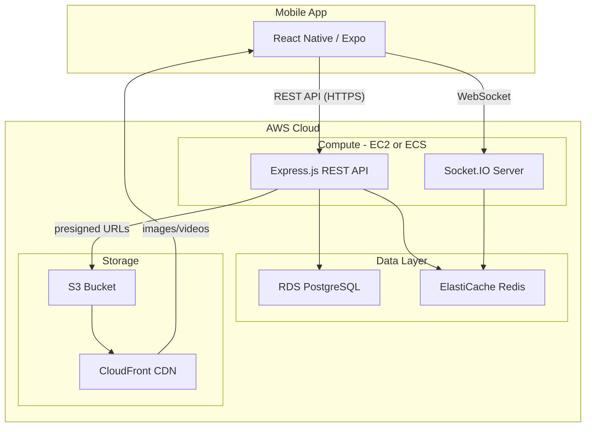
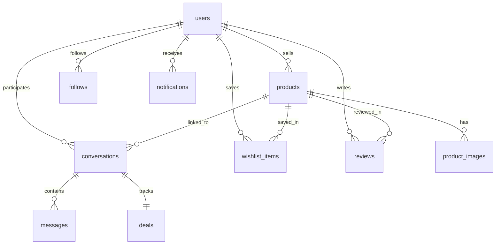
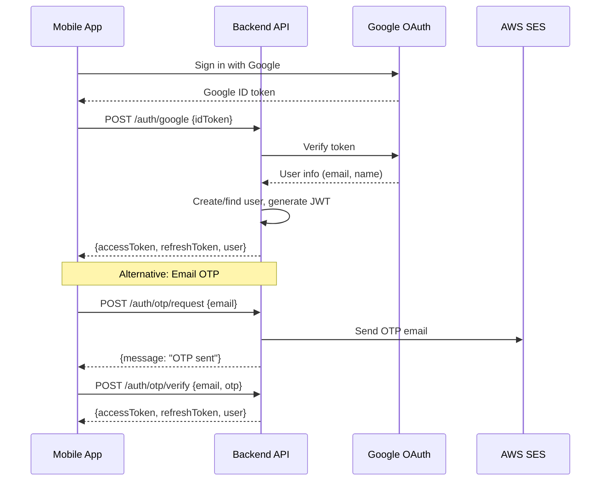

# safick Backend Setup Plan

## Current State

The frontend is a React Native/Expo app with full UI for: auth flow, onboarding, home feed (Discover/ForYou/Following), categories, product details, seller profiles, wishlist, messages/chat, notifications, and live/unbox. All data is **mock/local** -- `AsyncStorage` for auth, hardcoded arrays in `feedProducts.ts`, and context providers for wishlist/messages/profile. No real API calls exist yet.

**The critical insight about your app model:** safick is a **message-to-buy marketplace**, not a traditional e-commerce app. There is no cart, no checkout, no payment processing. The entire transaction happens through **chat**. This means **chat is your most important backend feature** -- not a secondary one.

---

## Architecture Overview




---

## 1. Project Structure

Create `backend/` as a sibling to `safick/` in the workspace root:

```
backend/
  src/
    config/         # DB, Redis, S3, env config
      database.ts
      redis.ts
      s3.ts
      env.ts
    middleware/      # Auth, validation, error handling, rate limiting
      auth.ts
      validate.ts
      errorHandler.ts
      upload.ts
    routes/          # Express route definitions
      auth.routes.ts
      user.routes.ts
      product.routes.ts
      chat.routes.ts
      wishlist.routes.ts
      notification.routes.ts
      search.routes.ts
    controllers/     # Request handlers
    services/        # Business logic
    socket/          # Socket.IO event handlers
      chat.socket.ts
      notification.socket.ts
    models/          # Prisma schema or TypeORM entities
    types/           # Shared types (sync with frontend types/index.ts)
    utils/           # Helpers (pagination, slug generation, etc.)
    app.ts           # Express + Socket.IO setup
    server.ts        # Entry point
  prisma/
    schema.prisma    # Database schema
    migrations/
  tests/
  package.json
  tsconfig.json
  .env.example
  Dockerfile
  docker-compose.yml  # Local dev (Postgres + Redis)
```

---

## 2. AWS Services for MVP


| Service                                | Purpose                                                  | Estimated Cost (MVP)               |
| -------------------------------------- | -------------------------------------------------------- | ---------------------------------- |
| **EC2** (t3.small)                     | Run Node.js backend                                      | ~$15/mo                            |
| **RDS PostgreSQL** (db.t3.micro)       | Primary database                                         | ~$15/mo (free tier eligible)       |
| **ElastiCache Redis** (cache.t3.micro) | Session cache, Socket.IO adapter, rate limiting          | ~$13/mo                            |
| **S3**                                 | Store product images and videos                          | Pay per use (~$5/mo at low volume) |
| **CloudFront**                         | CDN for media delivery (critical for Cameroon bandwidth) | Pay per use                        |
| **SES**                                | Transactional emails (OTP, notifications)                | Minimal                            |


**Total estimated MVP cost: ~$50-70/month**

Alternative: Start with a single EC2 instance running Postgres + Redis locally via Docker to keep costs at ~$15-20/month during development, then split into managed services before launch.

---

## 3. Database Schema (Key Tables)

This is the most important design decision. Your schema must reflect the **message-to-buy model**.




### Key tables:

- **users** -- id, email, display_name, username, avatar_url, gender, city, language_pref (en/fr), role (buyer/seller/both), phone, is_verified, bio, created_at, last_active_at
- **products** -- id, seller_id (FK users), name, description, price, currency (XAF), category, in_stock, stock_count, video_url, thumbnail_url, view_count, created_at, updated_at
- **product_images** -- id, product_id, image_url, sort_order
- **categories** -- id, name_en, name_fr, slug, icon_url
- **follows** -- follower_id, following_id, created_at (composite PK)
- **conversations** -- id, product_id (FK), buyer_id (FK), seller_id (FK), created_at, last_message_at
- **messages** -- id, conversation_id (FK), sender_id (FK), content, message_type (text/image/system), read_at, created_at
- **deals** -- id, conversation_id (FK, unique), status (inquired/negotiating/agreed/delivered/completed/cancelled), agreed_price, updated_at, completed_at
- **wishlist_items** -- user_id, product_id, created_at
- **reviews** -- id, reviewer_id (FK), seller_id (FK), product_id (FK), deal_id (FK), rating (1-5), comment, created_at
- **notifications** -- id, user_id (FK), type, title, body, data (JSONB), read_at, created_at
- **user_devices** -- id, user_id (FK), push_token, platform, created_at (for push notifications)

### Critical schema design considerations for your model:

1. **Every conversation is linked to a product** -- this is core to message-to-buy. The `conversations` table has a `product_id` FK, so when a buyer messages about a product, that product card is always attached.
2. **Deal status lives alongside the conversation** -- one deal per conversation, with status progression (Inquired -> Negotiating -> Agreed -> Delivered -> Completed).
3. **Reviews are tied to completed deals** -- a buyer can only review after deal status = "completed", preventing fake reviews.
4. **Seller = User with products** -- don't create a separate sellers table. Any user becomes a seller when they list a product. Use a `role` field or simply check if they have products.

---

## 4. Authentication Strategy

**Recommended: JWT + Google OAuth + OTP (phone/email)**




- **Access token**: Short-lived (15 min), sent in `Authorization: Bearer` header
- **Refresh token**: Long-lived (30 days), stored in `user_sessions` table, rotated on use
- **Google OAuth**: Use `@react-native-google-signin/google-signin` on the frontend, verify the ID token server-side
- **No password storage for MVP** -- Google OAuth + email OTP is simpler and more secure. Cameroon users are familiar with OTP from mobile money.

---

## 5. Real-Time Chat (Most Critical Feature)

Since chat IS the transaction mechanism, it must be reliable.

**Stack:** Socket.IO with Redis adapter (for horizontal scaling later)

**Socket events:**


| Event                | Direction        | Purpose               |
| -------------------- | ---------------- | --------------------- |
| `join_conversation`  | Client -> Server | Join a chat room      |
| `send_message`       | Client -> Server | Send a message        |
| `new_message`        | Server -> Client | Receive a message     |
| `typing`             | Bidirectional    | Typing indicator      |
| `message_read`       | Client -> Server | Mark messages as read |
| `deal_status_update` | Server -> Client | Deal status changed   |
| `user_online`        | Server -> Client | Online status         |


**Key design decisions:**

- Messages are **persisted to PostgreSQL** immediately (not just in-memory). Chat history must survive server restarts.
- Use Redis pub/sub as the Socket.IO adapter so it works across multiple server instances.
- **Offline messages**: If a user is offline when a message arrives, store it and deliver when they reconnect. Push notification goes out via FCM/APNs.
- **Conversation list**: Query `conversations` joined with latest message and unread count -- this is a hot query, consider caching in Redis.

---

## 6. File Uploads (Video + Images)

**Strategy: Presigned S3 URLs (client-side upload)**

The mobile app uploads directly to S3 using a presigned URL from the backend. This avoids routing large video files through your server.

```
1. App requests upload URL:  POST /uploads/presign {fileType, fileName}
2. Backend generates presigned S3 PUT URL (expires in 15 min)
3. App uploads file directly to S3
4. App sends the S3 key back to backend when creating/updating product
5. CloudFront serves the file via CDN
```

**Considerations for Cameroon:**

- **Video compression**: Enforce max file size (e.g., 50MB) and recommend compression on-device using `expo-av` or `ffmpeg-kit`
- **Thumbnail generation**: Use AWS Lambda triggered by S3 upload to auto-generate video thumbnails
- **Image optimization**: Generate multiple sizes (thumbnail, medium, full) via Lambda on upload
- **CloudFront is essential**: Users on 3G/4G in Douala need a CDN, not direct S3 access

---

## 7. API Routes Needed for MVP


| Method          | Route                         | Purpose                                            |
| --------------- | ----------------------------- | -------------------------------------------------- |
| POST            | `/auth/google`                | Google OAuth sign-in                               |
| POST            | `/auth/otp/request`           | Request email/phone OTP                            |
| POST            | `/auth/otp/verify`            | Verify OTP                                         |
| POST            | `/auth/refresh`               | Refresh access token                               |
| GET/PUT         | `/users/me`                   | Get/update current user profile                    |
| GET             | `/users/:id`                  | Get seller profile (public)                        |
| POST            | `/users/me/avatar`            | Upload profile picture                             |
| POST/PUT/DELETE | `/products`                   | CRUD products                                      |
| GET             | `/products`                   | List products (with filters, pagination, category) |
| GET             | `/products/:id`               | Get product details                                |
| GET             | `/products/feed/discover`     | Discover feed                                      |
| GET             | `/products/feed/following`    | Following feed                                     |
| GET             | `/products/search`            | Search products                                    |
| POST/DELETE     | `/follows/:userId`            | Follow/unfollow seller                             |
| GET             | `/follows/following`          | List followed sellers                              |
| GET/POST/DELETE | `/wishlist`                   | Wishlist CRUD                                      |
| POST            | `/conversations`              | Start conversation (with product_id)               |
| GET             | `/conversations`              | List conversations                                 |
| GET             | `/conversations/:id/messages` | Get messages (paginated)                           |
| PUT             | `/deals/:id/status`           | Update deal status                                 |
| POST            | `/reviews`                    | Create review (after deal completed)               |
| GET             | `/reviews/seller/:id`         | Get seller reviews                                 |
| GET             | `/notifications`              | Get notifications                                  |
| POST            | `/uploads/presign`            | Get presigned upload URL                           |


---

## 8. Key Considerations for Your App Model

### Things most tutorials won't tell you (specific to safick):

1. **Chat is not a feature, it's the product.** In most e-commerce apps, chat is secondary. In safick, if chat breaks, the entire business breaks. Invest heavily in chat reliability, message delivery guarantees, and offline support. Use a message queue (Redis streams or SQS) to ensure no messages are lost.
2. **The "deal status" flow is your checkout funnel.** Track conversion through deal statuses (Inquired -> Completed) the same way e-commerce apps track cart -> checkout -> payment. This is your core business metric.
3. **Seller response time is your most important metric.** If sellers don't respond to messages, buyers leave. Build response time tracking into the backend from day one. Show "Usually responds within X hours" on seller profiles. Consider sending push notifications to sellers when they have unanswered messages.
4. **You need a "product freshness" system.** Unlike traditional e-commerce where products sit in a catalog, video commerce is feed-driven. Products should decay in the feed over time. A product posted 3 months ago shouldn't rank the same as one posted today. Add `boosted_at` or use `created_at` with a decay factor in feed queries.
5. **Bandwidth optimization is not optional.** Your users are on mobile data in Cameroon. Every API response should be paginated (cursor-based, not offset-based). Images should be served in multiple resolutions. Videos should be compressed. Use `gzip` compression on all API responses. Consider lazy-loading strategies.
6. **Bilingual support (EN/FR) at the data level.** Product names and descriptions will be in whatever language the seller writes them in -- you can't translate user-generated content easily. But system strings (categories, notifications, deal status labels) should be bilingual. Store category names as `name_en` / `name_fr` in the DB. Send notification templates with language preference.
7. **Trust is everything in a marketplace without payments.** Since there's no escrow or payment protection, trust signals are critical: seller verification, review count, response time, join date, completed deals count. Build these into the user/seller profile API from the start.
8. **WhatsApp sharing is a growth feature, not a nice-to-have.** Your users already share products on WhatsApp. Build deep links (using Expo Linking + a simple web redirect page) so when someone shares a product link on WhatsApp, clicking it opens the app to that product. This is your #1 organic growth channel and also when they are using the app we pop a message for a riveiw.
9. **Don't over-engineer the feed algorithm.** For MVP, "Discover" = latest products with some randomization. "Following" = latest from followed sellers. "For You" = same as Discover until you have AI. Use simple PostgreSQL queries with proper indexing. You don't need Elasticsearch or a recommendation engine yet.
10. **Rate limit aggressively.** With a message-to-buy model, spam is a real risk (sellers spamming buyers, fake accounts messaging sellers). Rate limit message sending, product creation, and conversation creation from day one.

---

## 9. Tech Stack Summary


| Layer      | Technology               | Why                                                                  |
| ---------- | ------------------------ | -------------------------------------------------------------------- |
| Runtime    | Node.js 20 LTS           | Matches frontend language (TypeScript), team expertise               |
| Framework  | Express.js               | Simple, well-documented, huge ecosystem                              |
| Language   | TypeScript               | Type safety, shared types with frontend                              |
| ORM        | Prisma                   | Type-safe queries, excellent migrations, works great with PostgreSQL |
| Real-time  | Socket.IO                | Reliable WebSocket with fallback, room support, Redis adapter        |
| Database   | PostgreSQL 16 (RDS)      | Robust, supports JSONB, full-text search, future pgvector for AI     |
| Cache      | Redis 7 (ElastiCache)    | Session store, Socket.IO adapter, rate limiting, caching             |
| Storage    | S3 + CloudFront          | Scalable media storage + CDN for low-latency delivery                |
| Auth       | JWT + Google OAuth       | Industry standard, works well with mobile apps                       |
| Validation | Zod                      | Already used in frontend, share schemas                              |
| Email      | AWS SES                  | OTP delivery, transactional emails                                   |
| Push       | Supabase Cloud Messaging | Free, works on both Android and iOS                                  |


---

## 10. Development Sequence

Build and test in this order -- each step makes the next one possible:

1. **Project scaffolding** -- Express + TypeScript + Prisma + Docker Compose (local Postgres + Redis)
2. **Auth** -- Google OAuth + OTP + JWT middleware (everything else requires authenticated users)
3. **User profiles** -- CRUD + avatar upload + onboarding data
4. **Products** -- CRUD + image/video upload via presigned URLs + feed queries
5. **Follow system** -- Follow/unfollow + following feed
6. **Wishlist** -- Add/remove/list saved products
7. **Chat + Deal tracking** -- Socket.IO setup, conversations, messages, deal status flow
8. **Search** -- Full-text search with PostgreSQL `tsvector` (good enough for MVP)
9. **Notifications** -- In-app + push via FCM
10. **Connect frontend** -- Create an API service layer in the React Native app, replace mock data

