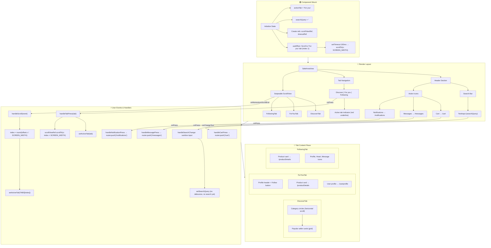

# clipCart Home Screen (index.tsx) — Flowchart & Improvement Ideas

## Structured Flowchart



---

## Simplified User Journey Flow

```mermaid
flowchart LR
    A[User lands on Home] --> B{Action?}
    B -->|Search| C[Type in search bar]
    B -->|Browse| D[Discover / For you / Following]
    B -->|Navigate| E[Cart / Messages / Notifications]
    
    C --> C1[searchQuery updates]
    C1 -.->|TODO| C2[No debounce or search logic]
    
    D --> D1[Tap tab or swipe]
    D1 --> D2[ScrollView scrolls]
    D2 --> D3[activeTab syncs]
    
    E --> E1[router.push to route]
    
    D --> F[Tap product / profile]
    F --> F1[/productDetails or /userprofile]
```

---

## Possible Improvements

### 1. **Search functionality (high impact)**
- **Current:** `searchQuery` is stored and sanitized, but there is no debouncing or actual search.
- **Improve:**
  - Add debounce (e.g. 300–500 ms) to avoid excessive updates.
  - Implement search (API or local filter) and show results.
  - Add a search results screen or inline results below the search bar.
  - Consider `onSubmitEditing` to trigger search on Enter.

### 2. **Initial scroll timing**
- **Current:** Uses `setTimeout(100)` to scroll to "For you" on mount.
- **Improve:**
  - Use `onLayout` or `InteractionManager.runAfterInteractions()` instead of a fixed timeout.
  - Or set initial `contentOffset` on the `ScrollView` so no scroll is needed.

### 3. **Scroll event handling**
- **Current:** Only `onMomentumScrollEnd` updates the active tab; fast swipes can feel slightly delayed.
- **Improve:**
  - Add `onScroll` with `Animated.event` for real-time tab sync during swipe.
  - Or use `scrollEventThrottle={16}` with `onScroll` for smoother feedback.

### 4. **Error handling UX**
- **Current:** Navigation errors are only logged to the console.
- **Improve:**
  - Show a toast or inline message when navigation fails.
  - Optionally retry or offer a fallback action.

### 5. **Performance**
- **Current:** All three tabs are mounted at once in the horizontal `ScrollView`.
- **Improve:**
  - Use `FlatList` with `windowSize` and `initialNumToRender` to lazy-load tabs.
  - Or keep `ScrollView` but lazy-mount tab content when it becomes visible.

### 6. **Accessibility**
- **Current:** Basic `accessibilityLabel` and `accessibilityRole` are set.
- **Improve:**
  - Add `accessibilityState` for the search input (e.g. busy while searching).
  - Ensure tab navigation works with screen readers (e.g. `accessibilityRole="tablist"` on the tab container).

### 7. **State management**
- **Current:** `activeTab` and `searchQuery` live only in this screen.
- **Improve:**
  - If search or tab state is needed elsewhere, move to context or a global store.
  - Persist last active tab (e.g. AsyncStorage) so users return to the same tab.

### 8. **Code organization**
- **Current:** Styles and logic are in one file.
- **Improve:**
  - Extract header (search + icons) into a reusable `HomeHeader` component.
  - Extract tab bar into `HomeTabBar`.
  - Move styles to a separate file or `useStyles` hook.

### 9. **Search bar behavior**
- **Current:** Search bar is always visible; no focus/blur handling.
- **Improve:**
  - Add `onFocus` to optionally expand or show recent searches.
  - Add clear button when `searchQuery` is non-empty.
  - Add cancel/back when search is active on mobile.

### 10. **Tab content consistency**
- **Current:** `ForYouTab` and `FollowingTab` have similar product cards but different layouts.
- **Improve:**
  - Create a shared `ProductCard` component.
  - Share product data via props or a data layer for consistency and easier updates.

---

## Quick Reference: Key Dependencies

| Element        | Depends on                          |
|----------------|-------------------------------------|
| `activeTab`    | Tab press, scroll position           |
| `searchQuery`  | `handleSearchChange`                 |
| Tab content    | `DiscoverTab`, `ForYouTab`, `FollowingTab` |
| Navigation     | `router.push()` via ROUTES constants |
